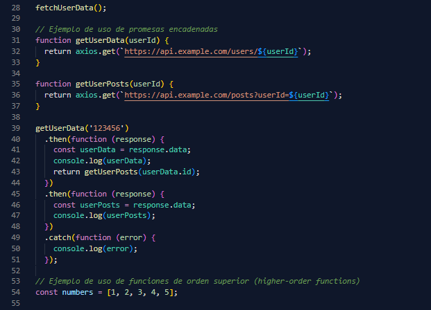

# JCcolors
Este proyecto es un tema personalizado para Visual Studio Code. Fue creado desde cero y está diseñado para ser agradable a la vista y fácil de usar.

El tema se ve algo parecido a

Si tienes algun aporte, sugerencia o comentario, no dudes en contactarme. :coffee: 

## Cómo creé el tema

El tema se creó utilizando dos paquetes instalados globalmente a través de npm: `yo` y `generator-code`. Se utilizó el comando `yo code` para iniciar el proceso de creación del tema.

El tema se basa en un tema oscuro y se creó un nuevo repositorio en GitHub donde se aloja el tema. Esto es útil para cuando se quiere publicar el tema en la tienda de extensiones de Visual Studio Code.

## Personalización del tema

El archivo principal para la personalización del tema se encuentra en la carpeta `themes`, en el archivo `extension-color-theme.json`. Aquí puedes cambiar los colores del tema a tu gusto.

Para probar el tema, simplemente presiona `F5` en Visual Studio Code. Esto abrirá una nueva ventana de Visual Studio Code con tu tema aplicado. Puedes abrir cualquier proyecto en esta ventana para ver cómo se ve tu tema con código real.

## Contribuir

Si te gusta este tema y quieres contribuir, no dudes en hacerlo. Cualquier contribución es bienvenida.

## Contacto

Si tienes alguna pregunta o comentario sobre este tema, no dudes en contactarme.